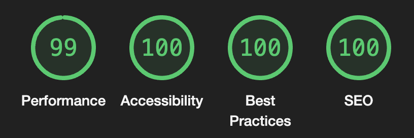

# Gigstr
[gigstr.app](https://gigstr.app) 🎵

Gigstr is a passion project built (multiple times...) and maintained by me. It was originally and always will be built out of utter selfishness - I've so obsessed with music and live music in general that I've (for the most part) collected every single ticket I've ever gotten. I wanted to digitalise this to the best of my ability with the tools at my dispersal and then add some flavour to it.

Why not be able to rate the shows you've been to? Why not then aggregate all of the ratings across the platform and produce some meaningful data back to users of the "technical" highest rated shows ever from the gigstr community?

The concept is simple, search for a gig you're going to and add it. Ever want to check what your gig schedule looks like just open up gigstr and take a look. Want to know how many "Rock" shows you're going to? Just filter it. Want to see the rest of the lineup or any specifics? OR get directions? Its all there.

We lean heavily on the Ticketmaster API which is excellent and most importantly free.

For sure it's something that has a primary use on an individual basis, but how interesting would it be if over time it built its own unique dataset based on the enjoyment of all the people using it? That's my goal.

## Tech stack

So this project started as a NextJS app alongside a NodeJS api server, and then I just thought why not try and stick everything inside 1 fullstack Next app!? I actually soon found out why not and its because of Vercel's edge functions and the cold starts. Its a shame but given the low latency traffic the app will get those lambda's will never be warm and it'll look like the app is slow on all requests. So we're back to a separately hosted api server! In the interest of the NextJS ecosystem the api layer authentication standards of passport are long gone, and we're embracing NextAuth here, too. This *should* be as singular principle, SSR single application focused as possible. The point is to shift everything we can onto Vercel and be able to manage even domains in one place, so we keep plugging away 💪🏼.

- NextJS
- NextAuth
- GraphQL (Apollo Client/Apollo Server)
- NodeJS
- Redis
- MongoDB
- Docker/Docker compose

Docker compose setup:
- **mongo** service to host DB
- **api** service to host graphql api
- **cache** service to host redis cache

### Frontend specifics:
- Chakra UI

### Infra
- FE hosted on Vercel
- BE hosted on EC2 using docker-compose
- Auto deploy setup for both FE and BE using Vercel and github action to auto-deploy api on push
- AWS Services used: EC2, S3

I mean...this thing is powerful, can do anything within reason and is light as balls. Check out the package file, its got the essentials and a couple of nice to haves, the other point of this project is to prove not only to myself but others that you don't need to go crazy, you can build a fullstack application in 1 place utilising a few bits. Don't ever take that for granted.

Also trying to consciously keep this as high as possible:

